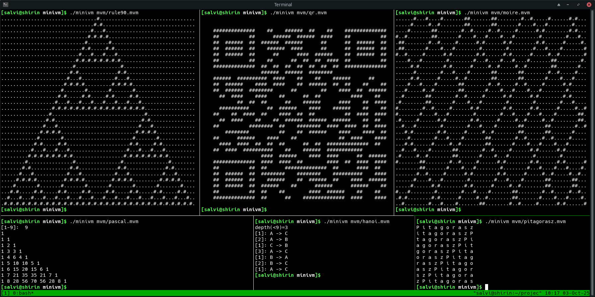
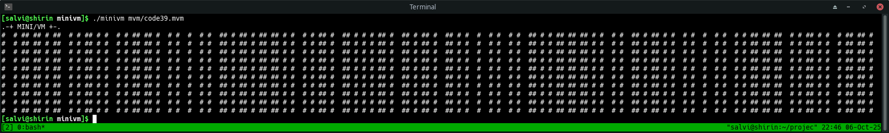

# MiniVM

A minimal virtual machine created for didactic purposes.

The specification is in the [VM source](minivm.c).

There is also an [assembler](mvmc) written in AWK,
supporting labels and some additional directives,
see [an example](src/hello.src).

The virtual machine is simple, but quite expressive.
Even [recursion](src/hanoi.src) can be done
with a little magic.

The 240-byte file size limit is just enough for a "Code 39" (ISO/IEC 16388:2023)
barcode generator (at most 15 characters):

